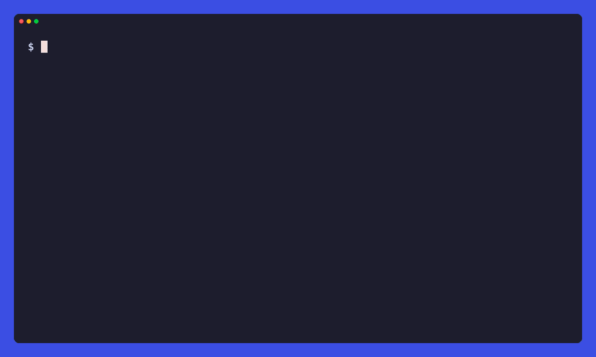

<div align="center">

# apisniff

**One tool for API recon: preflight defenses, capture real traffic, extract a usable spec.**

[](https://github.com/4LAU/apisniff/actions)
[](LICENSE)
[](https://github.com/4LAU/apisniff/releases)
[](#install)



<!-- DEMO:hero — swap in the recon walkthrough here once recorded:

-->

</div>

---

`probe` a target, `recon` real traffic through a clean browser, then turn the capture into an **OpenAPI spec** you can hand to a code generator, Postman, or an LLM. No automation fingerprint, real cookies, replayable captures.

```bash
apisniff probe example.com     # what defends it?
apisniff recon example.com     # log in, capture real traffic
apisniff spec example.com      # → OpenAPI spec
```

## Why apisniff

- **Reads defenses in ~10 seconds** — classifies 25+ vendor products (Cloudflare, Akamai, DataDome, PerimeterX, Imperva, Kasada, and more).
- **Captures past bot detection** — a clean Chrome with no automation fingerprint, routed through a local MITM proxy, so you log in by hand past defenses that block headless tools.
- **Captures replayable cookies** — reads the real on-the-wire `Cookie`/`Set-Cookie` headers on XHR/fetch, so authenticated captures actually replay.
- **Extracts a real spec** — OpenAPI 3.x with schema inference, example values, and a GraphQL operation catalog.
- **Replays for drift** — fires captured calls at the live API and tells you what changed.
- **Exports safely** — derived artifacts only, no raw traffic, no credentials.
- **One static binary** — Go, no Python runtime, macOS and Linux (Intel + ARM).

## Install

```bash
brew tap 4LAU/tap && brew install apisniff
```

<details>
<summary>From source, or on Windows</summary>

```bash
go build -ldflags="-s -w" -o apisniff ./cmd/apisniff
```

apisniff ships prebuilt binaries for macOS and Linux (Intel and Apple/ARM). On Windows, run it under [WSL2](https://learn.microsoft.com/windows/wsl/install) with the Linux build.
</details>

## Quick start

```bash
# 1. Check what defenses a site has
apisniff probe example.com

# 2. Capture real traffic — opens a clean Chrome routed through a local proxy.
#    Log in by hand, exercise the app, then close the window (or Ctrl+C).
apisniff recon example.com

# 3. Turn the capture into an OpenAPI spec
apisniff spec example.com -o spec.yaml

# 4. Replay captured calls to detect drift
apisniff replay example.com
```

<details>
<summary>More commands — bundles, cleanup, sharing, CDP modes</summary>

```bash
# CDP mode: capture WebSocket frames or attach to an existing browser.
# (Does not capture Cookie/Set-Cookie on XHR/fetch.)
apisniff recon example.com --mode cdp-launch

# Run only the proxy (no browser) — point your own client at 127.0.0.1:8080
apisniff recon example.com --no-browser --port 8080

# List local capture bundles
apisniff bundles

# Remove old capture bundles after review
apisniff clean --older-than 30d --dry-run
apisniff clean --older-than 30d --yes

# Export a safe, shareable summary (no raw traffic, no credentials)
apisniff share example.com
```
</details>

## How it works

```
   probe ───────▶ recon ───────▶ spec ───────▶ replay
  defenses     real traffic    OpenAPI       drift check
  (10 sec)    (clean Chrome)   (inferred)     (live API)
```

1. **probe** — passive + differential checks name the WAF / anti-bot vendors before you touch the app.
2. **recon** — a fingerprint-free Chrome routed through a local MITM proxy captures the real wire, including auth cookies.
3. **spec** — captured traffic becomes an OpenAPI document with inferred schemas, examples, and a GraphQL catalog.
4. **replay** — captured calls are re-fired at the live API to surface drift (`match` / `drift` / `auth_expired` / `blocked`).

## Commands

| Command | Purpose | Docs |
|---------|---------|------|
| `probe` | Defense preflight: assess defenses, detect vendors, check rate limits | [Reference →](docs/commands/probe.md) |
| `recon` | Capture + classify: clean-Chrome proxy by default (real cookies), CDP modes for WebSocket frames | [Reference →](docs/commands/recon.md) |
| `analyze` | Offline analysis: import HAR, Burp XML, or JSONL captures | [Reference →](docs/commands/analyze.md) |
| `replay` | Replay captured calls and detect API drift | [Reference →](docs/commands/replay.md) |
| `spec` | Generate OpenAPI 3.0.3 from captured traffic | [Reference →](docs/commands/spec.md) |
| `share` | Export shareable summary (no raw traffic, no credentials) | [Reference →](docs/commands/share.md) |
| `bundles` | List local capture bundles (`--credentials`, `--json`) | `apisniff bundles --help` |
| `clean` | Delete local capture bundles (`--older-than`, `--domain`, `--all`, `--dry-run`) | `apisniff clean --help` |

Every command supports `--help`. See the [CLI spec](docs/spec.md) for output-format contracts.

## What to do with the spec

```bash
# Generate a client library
openapi-generator generate -i spec.yaml -g python -o client/

# Import into Postman: File → Import → select spec.yaml

# Feed to an LLM
cat spec.yaml | llm "write a Python client for this API"
```

## Documentation

- [Getting started](docs/guides/getting-started.md) — install to API map in 5 minutes
- [Workflow recipes](docs/guides/workflows.md) — map an API, check for drift, compare defenses
- [Capture formats](docs/guides/capture-formats.md) — HAR, Burp XML, JSONL explained

## Safety

> **Only run apisniff against systems you own, administer, or have explicit permission to test.** It sends real requests from your IP and can capture sensitive session data.

- **Your IP is exposed.** apisniff sends real HTTP requests from your IP; aggressive probing can get you rate-limited or blocked. Results reflect your IP's reputation — use `--proxy` to compare vantage points.
- **Capture files contain secrets.** `recon` and `analyze` capture full HTTP traffic, including cookies, tokens, and API keys. Raw bundles are stored locally with owner-only permissions and are **never safe to share, commit, or upload** — use `apisniff share` for a safe export.
- **Captures don't auto-delete.** Bundles persist until you remove them with `apisniff clean`. apisniff warns about bundles older than 30 days.

<details>
<summary><b>How recon mode works</b> — fingerprint, certificates, and the cert warning bar</summary>

<br>

`apisniff recon` defaults to proxy mode. It starts a local HTTP/HTTPS MITM proxy (with HTTP/2) and launches a real Chrome routed through it. That Chrome carries **no automation fingerprint** — no `--enable-automation`, no DevTools/CDP attachment, so `navigator.webdriver` is false — which lets you log in past bot-detection vendors (DataDome, PerimeterX, and similar) that block CDP-launched browsers. Because the proxy sees the wire, it captures the **real Cookie/Set-Cookie headers on XHR/fetch**, so authenticated captures are replayable. Chrome runs a fresh, disposable profile (wiped on exit, separate from your everyday Chrome). Log in, exercise the app, then **close the browser window** (or press Ctrl+C) to finish.

**Certificates.** For HTTPS, the launched Chrome accepts the proxy's certificates via `--ignore-certificate-errors-spki-list`, which trusts **only apisniff's CA, matched by its public-key hash**. Every other certificate is still validated normally — this is the narrow, scoped flag, not the blunt `--ignore-certificate-errors`. So when Chrome warns that "security will suffer," the relaxation is one cert wide and confined to the throwaway profile; your everyday Chrome is untouched. The hash is passed on the command line, so **nothing is installed in any OS trust store and there is no keychain prompt**. Chrome shows a cosmetic "unsupported command-line flag" warning bar — browser UI only, invisible to pages. The CA private key at `~/.apisniff/ca-key.pem` is sensitive (anything holding it can forge HTTPS certs for clients that trust the CA) and is stored with owner-only permissions.

**Your own client.** Pass `--no-browser` to start only the proxy and route your own client through `127.0.0.1:<port>`; in that case trust `~/.apisniff/ca-cert.pem` in that client yourself.

**CDP modes.** `--mode cdp-launch` is the only mode that captures WebSocket frames, plus `resource_type` and cache/service-worker/body-size metadata, from Chrome's Network domain. It does **not** capture Cookie/Set-Cookie on XHR/fetch (those aren't exposed over CDP), so CDP captures aren't replayable the way proxy captures are. `--mode cdp-attach` connects to an existing Chrome DevTools endpoint (`--remote-url` or `--port`) with the same capabilities and the same cookie limitation.
</details>

<details>
<summary><b>What recon can and cannot see</b></summary>

<br>

CDP modes only record traffic from the Chrome session apisniff launches or attaches to. Proxy mode only records traffic from clients explicitly configured to use the local proxy.

Other apps, browser windows, background services, and normal device traffic are **not** routed through apisniff unless you configure them for the same capture mode. apisniff does not turn on device-wide network capture, install a VPN, or monitor traffic outside the chosen session.

To end a proxy capture, close the launched Chrome's last window/tab or press **Ctrl+C** in the terminal — either one saves the bundle. (apisniff notices the window closing by watching the launched browser's own processes, with no automation hook on the page.) A port-in-use error usually means another capture session is still running on that port.
</details>

## Development

```bash
git clone https://github.com/4LAU/apisniff.git
cd apisniff
go test ./...
go build -o apisniff ./cmd/apisniff
```

See [CONTRIBUTING.md](CONTRIBUTING.md) for the development workflow and [SECURITY.md](SECURITY.md) for vulnerability reporting. Build release binaries with `-ldflags="-s -w"` to keep binary size under the distribution target.

## License

MIT
